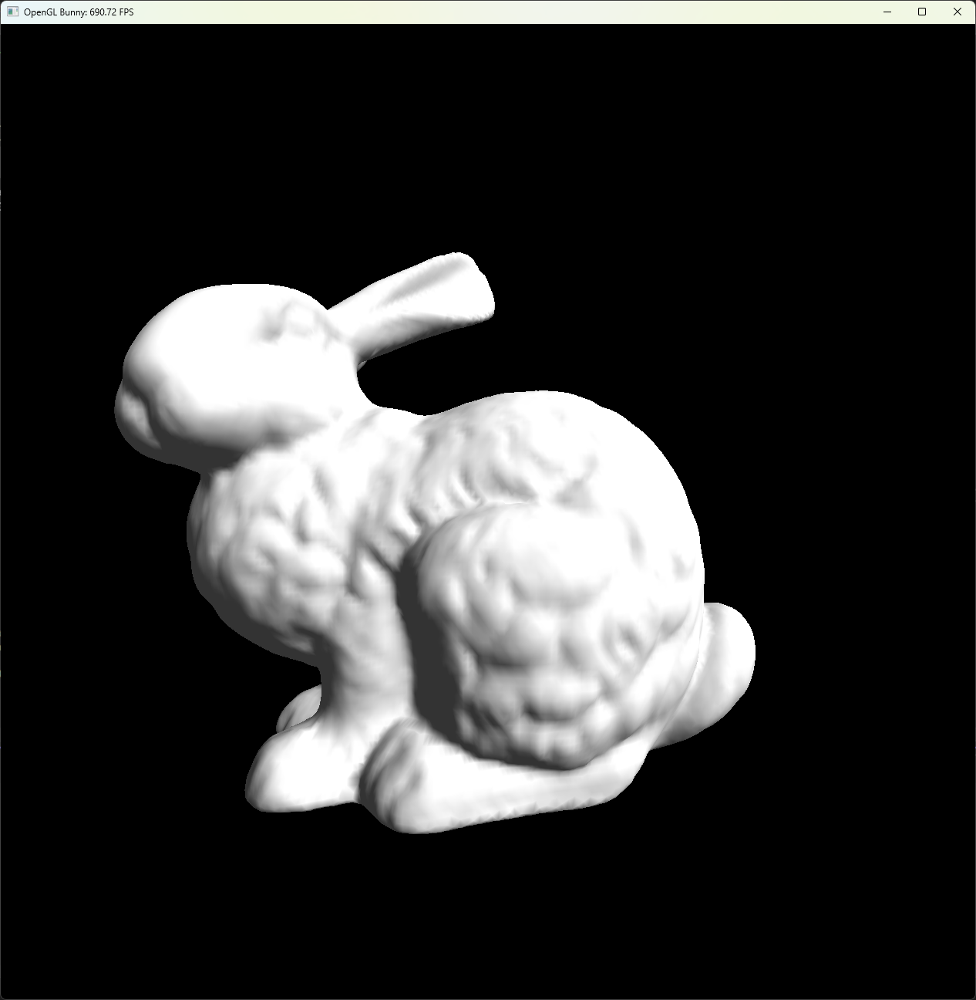
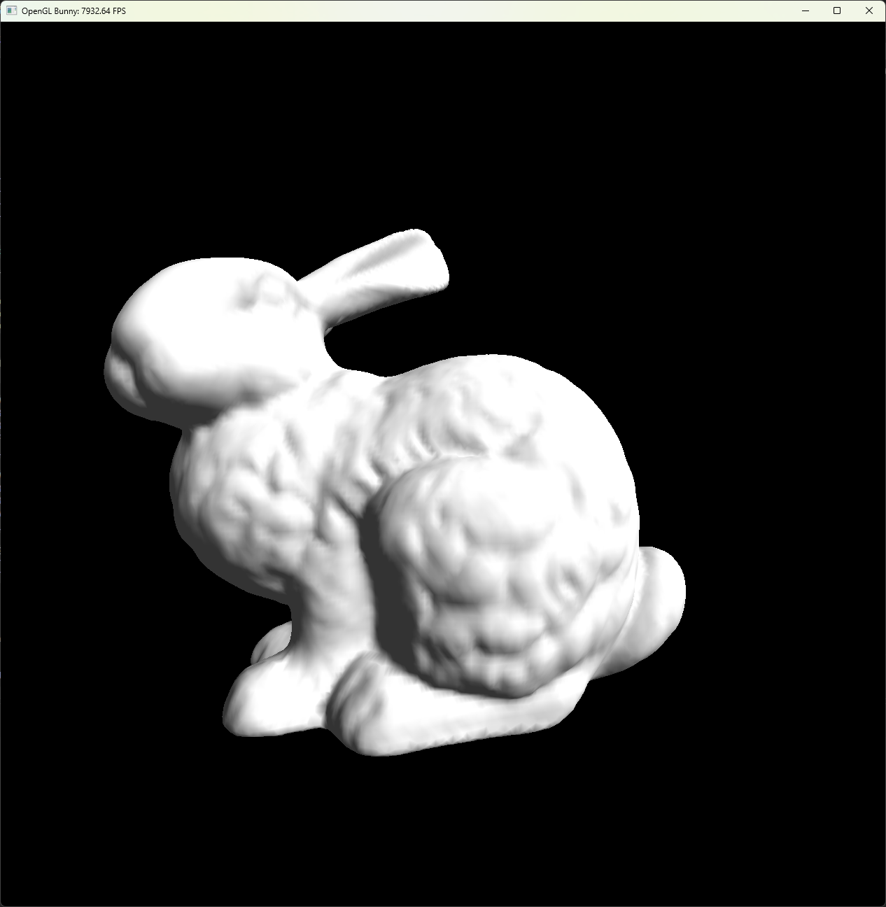

# Computer Graphics Assignment8

## Overview

- OpenGL로 삼각형 메시(토끼)를 렌더링한다.
- Immediate 방식과 Vertex Arrays(VAO/VBO) 방식을 각각 구현한다.
- 렌더링 속도를 측정해 FPS(초당 프레임 수)를 GLUT 윈도우 제목에 실시간으로 표시한다.

---

## Table of Contents

- [Result Image](#result-image)  
- [Compilation Instructions](#compilation-instructions)  
- [Run Instructions](#run-instructions)  
- [Short Description](#short-description)  
- [Setup & Parameters](#Parameters) 
---

## Result Image

### Q1 Average FPS : 약 790FPS 정도로 출력

### Q2 Average FPS : 초반에 상승하다가 약 7800FPS 정도로 출력

### 결과 분석: VAO/VBO 방식이 오버헤드를 대폭 줄여 활용하기 때문에 Immediate Mode보다 훨씬 높은 FPS를 보인다.
---

## Compilation Instructions

### Using Visual Studio
1. **솔루션 열기**  
   - `Assignment8.sln` 파일을 Visual Studio에서 엽니다.
2. **Clean & Rebuild**  
   - 상단 메뉴에서 **Build > Clean Solution**을 선택한 뒤, **Build > Rebuild Solution**을 실행하여 최신 코드를 빌드합니다.  
   - 단축키 **Ctrl + Shift + B**로 빌드할 수도 있습니다.

---

## Run Instructions

### 1. 실행 파일 실행
- 빌드가 완료되면 `bin` 폴더에 `Assignment8_Q1.exe`, `Assignment8_Q2.exe` 파일이 생성됩니다.  
- 더블 클릭하여 실행하세요.

### 2. Visual Studio에서 실행
1. **솔루션 탐색기**에서 Q1은 `Assignment8_Q1` 프로젝트를 Q2는 `Assignment8_Q2` 마우스 오른쪽 클릭  
2. **Set as Startup Project**를 선택  
3. **Ctrl + F5**를 눌러 디버깅 없이 실행

- 창을 닫으려면 **ESC** 키 또는 **Q** 키를 누릅니다.  

## Short Description

**Q1-Immediate Mode**는 glBegin/glEnd 사이에서 매 프레임마다 정점 데이터를 CPU에서 GPU로 전송하여 처리하는 렌더링 방식. 이 프로그램은 OpenGL을 사용해 bunny.obj를 렌더링합니다.

### 1. OpenGL Initialization
- `main` 함수는 기본 시작 시 렌더링 창을 생성합니다.

### 2. Mesh Loading
- 렌더링 창을 생성하고 `load_mesh("bunny.obj")`를 호출합니다.
- 이 데이터는 시스템 메모리에 전체 메시 데이터를 저장하는 3개의 전역 C++ `std::vector` 컨테이너(`gPositions`, `gNormals`, `gTriangles`)를 채웁니다.

### 3. ParameterSetup

- **Enable Depth Test**: `glEnable(GL_DEPTH_TEST)`를 호출하여 3D 공간에서 객체의 앞뒤 관계가 올바르게 렌더링되도록 설정합니다.
- **Disable Back-face Culling**: `glDisable(GL_CULL_FACE)`를 통해 모델의 뒷면도 렌더링되도록 합니다.
- **Enable Automatic Normalization**: `glEnable(GL_NORMALIZE)`를 호출하여 조명 계산에 사용될 법선 벡터의 크기를 항상 1로 유지합니다.
- **Set Projection**: `glMatrixMode(GL_PROJECTION)`과 `glFrustum`을 사용하여 원근 투영을 설정하고 카메라의 시야를 정의합니다.
- **Model Transformation**: `glTranslatef`와 `glScalef`를 사용하여 렌더링할 버니 모델을 특정 위치로 이동시키고 10배 확대합니다.
- **Global Lighting**: 장면에 약한 회색의 Global Ambient을 설정합니다.
- **Set Material**: Ambient, Diffuse는 흰색으로 완전히 반사하고, Specular은 반사하지 않는 무광 재질로 설정합니다.
- **Set Light Source**: `glEnable(GL_LIGHTING)`으로 조명 시스템을 활성화하고, 흰색의 방향성 광원(`GL_LIGHT0`) 하나를 장면에 추가합니다.

### 4. Render Loop (`display` function)
1.  **Clear Buffers**: 각 프레임이 시작될 때, `glClear`가 이전 프레임의 색상 및 깊이 정보를 지웁니다.
2.  **CPU-to-GPU Data Transfer**: 렌더링 과정은 `glBegin(GL_TRIANGLES)`와 `glEnd()` 사이에 포함됩니다.
3.  **Draw Call**: 코드는 `gTriangles` 벡터에 있는 모든 삼각형을 순회합니다. 각 삼각형의 각 정점에 대해 `glNormal3f()`와 `glVertex3f()`를 별도로 호출합니다. 이 명령어들은 해당 단일 정점의 법선 및 위치 데이터를 CPU에서 GPU로 즉시 전송합니다.

---
네, VBO/VAO를 사용하도록 변경된 코드(`Hw8_Q2_main.cpp` 기반)의 설명을 이전 형식에 맞춰 정리해 드리겠습니다.

---

**Q2-Retained Mode (VBO/VAO)** 는 정점 데이터를 미리 GPU 메모리에 저장(Retain)하고, 매 프레임 간단한 그리기 명령만으로 렌더링하는 방식입니다. 이 프로그램은 VAO와 VBO를 사용해 bunny.obj를 효율적으로 렌더링합니다.

### 1. Data Structure Definition (`Mesh.h`)
- 렌더링에 필요한 버퍼 ID(VAO, VBO, EBO)와 인덱스 데이터를 체계적으로 관리하기 위해 `RenderData` 구조체를 정의합니다.

### 2. Mesh Data Upload (`SetupBuffers` function)
- **VBO/EBO 생성**: 정점의 위치, 법선, 인덱스 데이터를 저장할 VBO와 EBO를 GPU에 생성합니다.
- **데이터 복사**: `load_mesh`로 읽어온 CPU 메모리의 정점 데이터(`gPositions`, `gNormals`)와 인덱스 데이터를 GPU 메모리에 있는 VBO와 EBO로 한 번만 복사합니다.
- **VAO 설정**: 생성된 버퍼들과 데이터의 형식을 하나의 VAO에 상태 정보로 저장합니다.

### 3. ParameterSetup
- 이 부분은 **Q1-Immediate Mode와 동일**합니다.
- `glEnable`, `glMatrixMode`, `glLightfv`, `glMaterialfv` 등 함수를 그대로 사용하여 조명, 재질, 변환을 설정합니다.

### 4. Render Loop (`display` function)
1.  **Clear Buffers**: 각 프레임이 시작될 때, `glClear`가 이전 프레임의 색상 및 깊이 정보를 지웁니다.
2.  **Bind VAO**: `glBegin`/`glEnd` 루프 대신, `glBindVertexArray()`를 호출하여 `SetupBuffers`에서 설정했던 모든 버퍼와 상태 정보를 한 번에 불러옵니다.
3.  **Draw Call**: `glDrawElements()` 함수 하나만 호출합니다. 이 명령어는 GPU에 "VAO에 설정된 데이터를 사용하여 삼각형을 그려라"고 지시하며, CPU-GPU 간의 데이터 전송이 거의 발생하지 않습니다.

## Parameters

-   **Window 크기**: 1280×1280
-   **Material 설정**:
    -   Ambient ka = (1, 1, 1)
    -   Diffuse kd = (1, 1, 1)
    -   Specular ks = (0, 0, 0)
    -   Shininess p = 0
-   **Light**:
    -   전역 조명(Ambient) 강도 Ia = (0.2, 0.2, 0.2)
    -   **단일 방향 광원**:
        -   Ambient = (0, 0, 0)
        -   Diffuse = (1, 1, 1)
        -   Specular = (0, 0, 0)
        -   광원 방향 = (–1, –1, –1)
-   **Model 변환**:
    -   Scale: 모든 축에 대해 10배
    -   Translate: (0.1, –1, –1.5)
-   **Camera**:
    -   위치 e = (0, 0, 0)
    -   좌표축 u = (1, 0, 0), v = (0, 1, 0), w = (0, 0, 1)
-   **Projection**:
    -   Frustum l = −0.1, r = 0.1, b = −0.1, t = 0.1, n = 0.1, f = 1000

