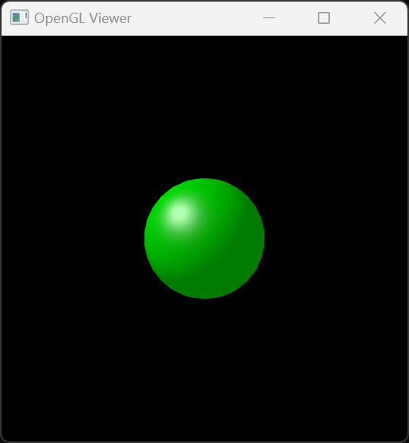

# Computer Graphics Assignment7

## Overview

- 이 과제의 목표는 OpenGL으로 간단한 셰이더 프로그램을 작성하여 하나의 음영 처리된 구(Phong Shading)를 그리는 것
  - 단일 구를 여러 삼각형으로 분할하여, 각 픽셀마다 보간된 법선을 이용해 Blinn–Phong 모델로 조명을 계산
- 구의 정점과 삼각형 정보는 HW5에서 이용한 sphere_scene.cpp의 `create_scene()` 함수를 통해 생성

---

## Table of Contents

- [Result Image](#result-image)  
- [Compilation Instructions](#compilation-instructions)  
- [Run Instructions](#run-instructions)  
- [Short Description](#short-description)  
- [Setup & Parameters](#Parameters) 
---

## Result Image

### Phong Shading  
  

---

## Compilation Instructions

### Using Visual Studio
1. **솔루션 열기**  
   - `Assignment7.sln` 파일을 Visual Studio에서 엽니다.
2. **Clean & Rebuild**  
   - 상단 메뉴에서 **Build > Clean Solution**을 선택한 뒤, **Build > Rebuild Solution**을 실행하여 최신 코드를 빌드합니다.  
   - 단축키 **Ctrl + Shift + B**로 빌드할 수도 있습니다.

---

## Run Instructions

### 1. 실행 파일 실행
- 빌드가 완료되면 `bin` 폴더에 `Assignment7.exe` 파일이 생성됩니다.  
- 더블 클릭하여 실행하세요.

### 2. Visual Studio에서 실행
1. **솔루션 탐색기**에서 `Assignment7` 프로젝트를 마우스 오른쪽 클릭  
2. **Set as Startup Project**를 선택  
3. **Ctrl + F5**를 눌러 디버깅 없이 실행

- 창을 닫으려면 **ESC** 키 또는 **Q** 키를 누릅니다.  

## Short Description

**Phong Shading**은 픽셀 단위로 법선을 보간하고 Blinn–Phong 모델로 조명을 계산하는 기법입니다. 이 프로그램은 OpenGL을 사용해 Phong 셰이딩된 구를 렌더링합니다.

### 1. Shader Setup
- `Phong.vert`와 `Phong.frag`를 컴파일·링크해 셰이더 프로그램을 만듭니다.

### 2. Uniform Configuration
- 재질(ka, kd, ks, p), 광원(Ia, lightPos, lightColor), 카메라(view, proj), 감마(γ) 유니폼을 셰이더에 전달합니다.

### 3. Mesh Generation
- `create_scene()`로 구의 정점(Vertex)과 인덱스(Index) 배열 생성 후 VBO/VAO에 업로드합니다.

### 4. Render Loop
1. **Transform**: 버텍스 셰이더에서 `model`, `view`, `proj` 매트릭스로 정점 변환  
2. **Back-Face Culling**: `glEnable(GL_CULL_FACE)`로 뒤면 제거  
3. **Draw**: `glDrawElements` 호출 → GPU 래스터라이저가 프래그먼트 생성  
4. **Phong Shading**: 프래그먼트 셰이더에서 보간된 법선으로 Ambient/Diffuse/Specular 계산 후 감마 보정(γ=2.2)  
5. **Swap Buffers**: 결과를 화면에 출력  

### 5. Cleanup
- VAO, VBO, 셰이더를 삭제하고 GLFW를 종료합니다.  

## Parameters

- **Window 크기**: 512×512  
- **OpenGL 버전**: 3.3 Core Profile  
- **Material 설정**:  
  - Ambient ka = (0, 1, 0)  
  - Diffuse kd = (0, 0.5, 0)  
  - Specular ks = (0.5, 0.5, 0.5)  
  - Shininess p = 32  
- **Ambient Light**: Ia = 0.2  
- **Point Light**:  
  - Position = (−4, 4, −3) (world space)  
  - Color = (1, 1, 1), intensity = 1.0, no falloff  
- **Camera**:  
  - Eye = (0, 0, 0), Center = (0, 0, −1), Up = (0, 1, 0)  
- **Projection**:  
  - Frustum l = −0.1, r = 0.1, b = −0.1, t = 0.1, n = 0.1, f = 1000  
- **Gamma Correction**: γ = 2.2  
